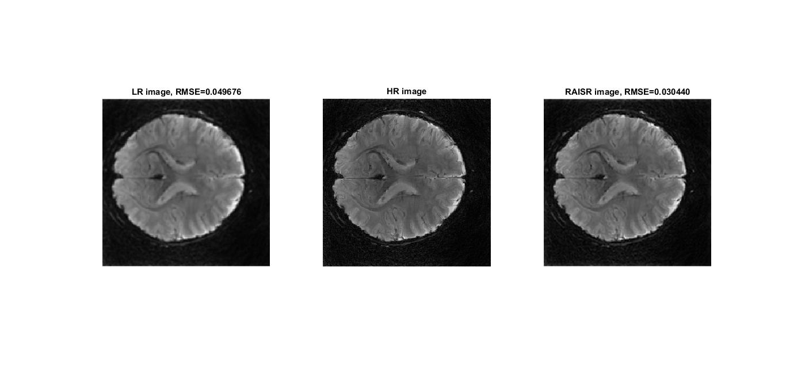

# RAISR-for-MR-Image
An implementaion of Rapid and Accurate Image Super Resolution (RAISR) in Matlab for MR image
## Reference
The code here is an implementation of the paper:
>Romano, Yaniv, John Isidoro, and Peyman Milanfar. "RAISR: rapid and accurate image super resolution." IEEE Transactions on Computational Imaging 3.1 (2017): 110-125.
## Purpose
This project is oriented for the application of RAISR into MR image domain. 
## Code Structure
**train**: script for training  
**Hashtable**: calculate the angle, strength and coherence as stated in the paper  
**test**: script for testing  
**RMSE**: A self-implemented function for Root Mean Squared Error (RMSE)  

For confidentiality reasons, the training data we use cannot be uploaded, anyone who is interested can use your own gray-scale image. Right now it only support .mat files.
## Results

